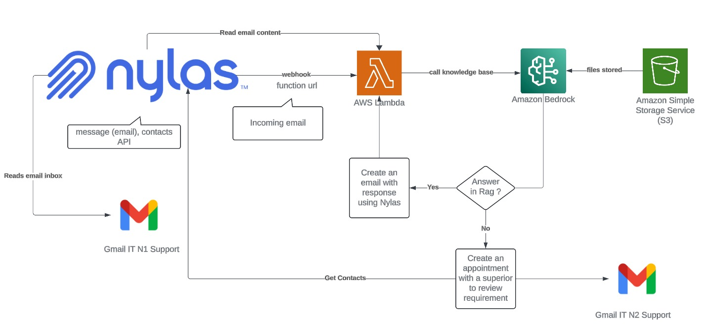

# Nylas AI and Communications Challenge

This repository was created to share the application for the [Nylas AI and Communications Challenge](https://dev.to/devteam/join-us-for-the-nylas-ai-and-communications-challenge-3000-in-prizes-3dnm).

## Prerequisites

- AWS Account
- Amazon Text Embeddings V2, Amazon Text Premier (or any other model compatible with text embeddings and RAG)
- [Nylas Account](https://www.nylas.com/), API Key, and Grant ID
- Gmail Account (or any other email client like Outlook)

## Walkthrough

To correctly execute this code, you will need an S3 bucket. Inside this bucket, upload one or more PDF files containing manuals or technical content.

1. **Create an S3 Bucket:** Upload your PDF files to this bucket.

2. **Create a Knowledge Base in Amazon Bedrock:**
   - Select Amazon Text Embeddings V2 as your model.
   - Choose the S3 bucket as the data source.
   - After the RAG (Retrieval-Augmented Generation) setup, execute a sync.

3. **Test the Model:** Ensure that the appropriate models are accessible. For this guide, we selected Amazon Text Premier.

4. **Set Up Nylas:**
   - Create an account in Nylas.
   - Link an email client.
   - Obtain the respective Grant ID and API Token.

5. **Run the Code:**
   - Deploy this code in an AWS Lambda function.
   - Enter the necessary variables as Lambda environment variables or store them in AWS Systems Manager Parameter Store.

## Customization

You can customize the code to fit your needs:
- Instead of filtering by subject, you can use the Nylas API to read the email body.
- For contacts, you can filter based on company name.
